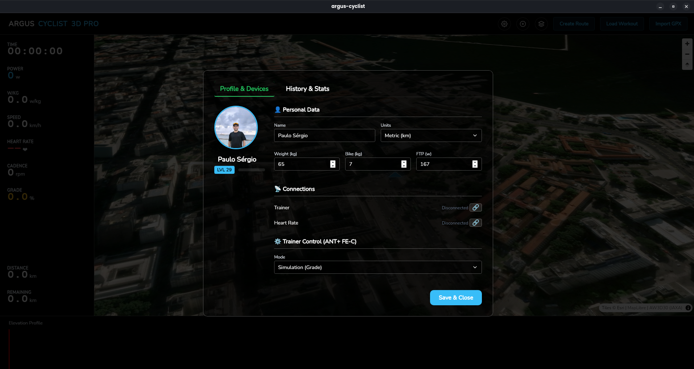
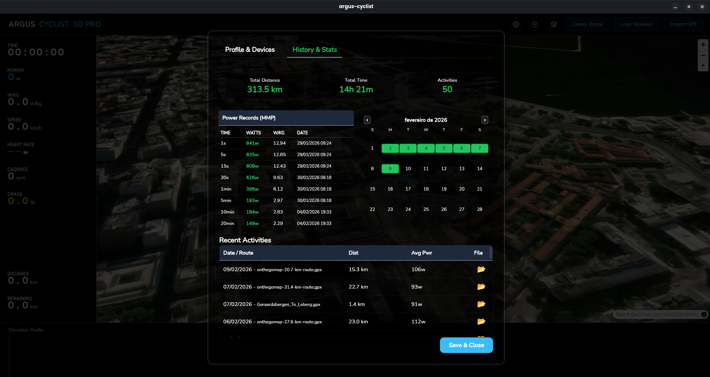
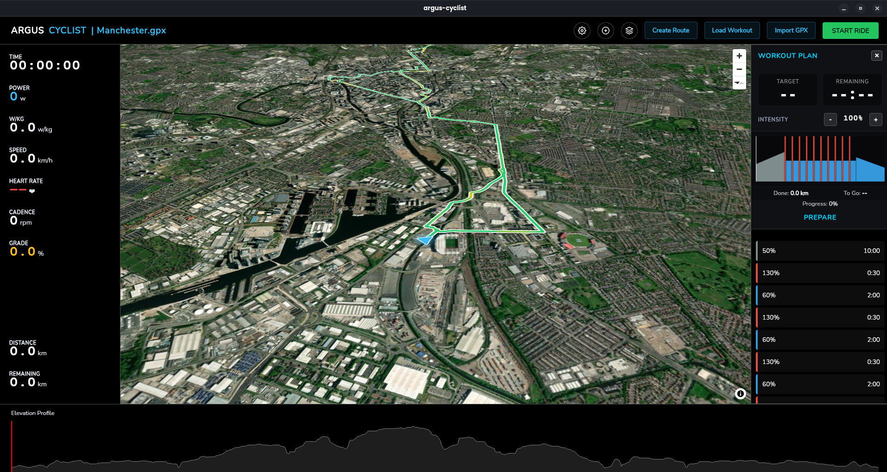
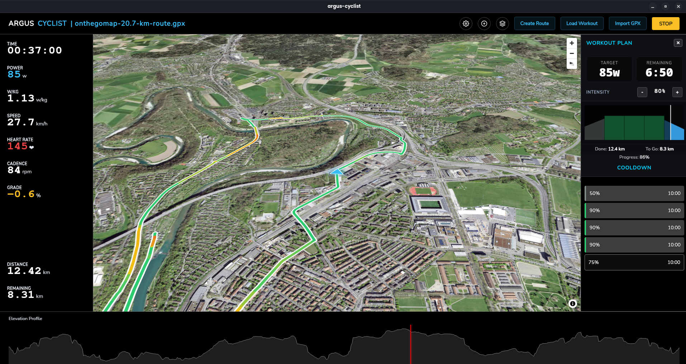

# Argus Cyclist Simulator


**Argus Cyclist** is a cross-platform open-source software for indoor cycling simulation, offering real-time communication with smart trainers, 3D map visualization, and support for multiple training modes such as free ride and structured workouts.






## Simulation & Connectivity

* **Smart Trainer Support (BLE & ANT+):** Connects natively to FTMS and ANT+ FE-C compatible trainers (e.g., Tacx, Wahoo, Elite, Thinkrider) and Heart Rate monitors.
* **Physics Engine:** Real-time speed calculation based on power (Watts), rider weight, bike weight, rolling resistance, and aerodynamic drag.
* **Grade Simulation:** The trainer automatically adjusts resistance based on the virtual terrain slope.

### Gamification & Progression

* **Leveling System:** Earn **XP (Experience Points)** passively by riding.
* **Dynamic Rewards:** Gain more XP for climbing and covering long distances.
* **Persistent Profile:** Your stats (Level, Total XP, FTP, Weight) are saved locally using SQLite.
* **Visual HUD:** Real-time XP bar and power zones.

### Immersive 3D Map

* **MapLibre Integration:** Powered by MapLibre GL JS with 3D Terrain-RGB for realistic topography. Features a 3D Globe projection with atmospheric fog and high-fidelity Satellite (Esri) or Vector (Day) themes.
* **Smart Route Rendering:** Route lines change color dynamically based on gradient (Green = Flat/Descent, Red = Steep Climb).
* **Occlusion System:** The route renders correctly behind 3D buildings for better depth perception.
* **Smooth Animation:** Interpolated cyclist movement at 60fps, eliminating GPS "jumping".

### Tools & Data

* **Route Editor:** Create custom routes directly inside the app by clicking points on the map.
* **GPX Import:** Ride any real-world route by importing standard `.GPX` files.
* **Activity History:** Calendar view, monthly stats, and "Power Curve" analysis.
* **Data Export:** Automatically generates `.FIT` files compatible with Strava, Garmin Connect, and TrainingPeaks.

## Technologies

* **Backend:** Go (Golang)
* **Frontend:** JavaScript (ES6+), MapLibre GL JS + OSRM
* **Framework:** Wails (to create the native desktop application)
* **Database:** SQLite (for local user data)

## Prerequisites

Before starting, ensure you have installed:

* [Go](https://go.dev/) (v1.20+)
* [Node.js](https://nodejs.org/) & npm
* [Wails CLI](https://wails.io/) (`go install github.com/wailsapp/wails/v2/cmd/wails@latest`)

## Installation and Setup

1. **Clone the repository:**

    ```bash
    git clone [https://github.com/your-username/argus-cyclist.git](https://github.com/your-username/argus-cyclist.git)
    cd argus-cyclist
    ```

2. **Install dependencies:**

    ```bash
    # Go dependencies
    go mod tidy

    # Frontend dependencies
    cd frontend
    npm install
    cd ..
    ```

## How to Run

To start the application in development mode (with Hot Reload):

```bash
wails dev
```

## Contributing

Pull requests are welcome. For major changes, please open an issue first to discuss what you would like to change.

## License

This project is licensed under the **GNU General Public License v3.0** - see the [LICENSE](LICENSE) file for details.
