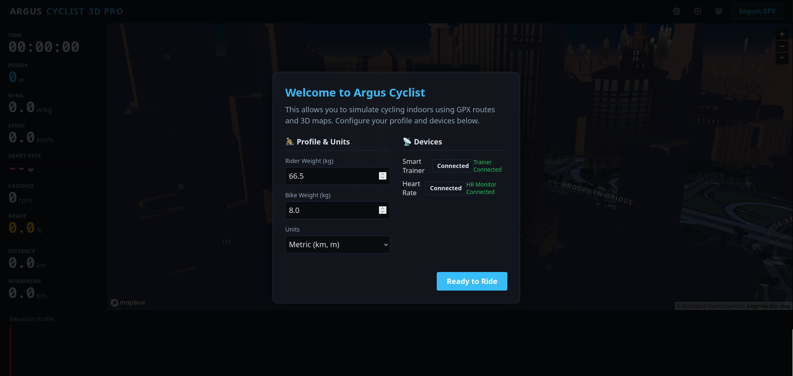
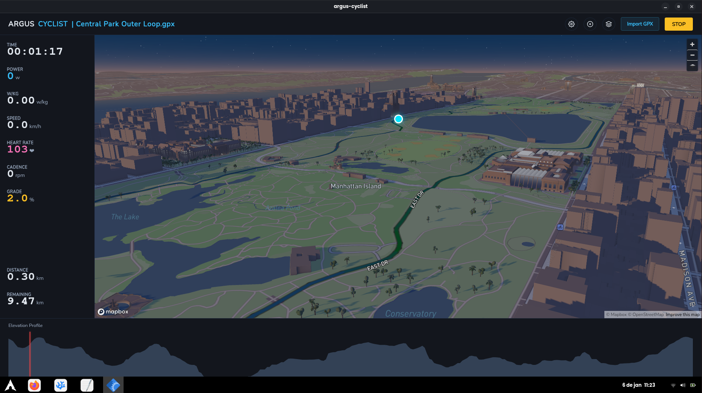

# Argus Cyclist Simulator

**Argus Cyclist** is an open-source cycling simulator built with **Go (Wails)** and **Mapbox GL JS**. It allows you to connect Smart Trainers via Bluetooth (BLE) and simulate rides in realistic 3D environments based on real GPS data.




## Features

* **Bluetooth Connection (BLE):** Support for Smart Trainers (FTMS/Cycling Power) and Heart Rate Monitors.
* **Immersive 3D Map:** Integration with Mapbox Standard (v3) for terrain visualization, dynamic lighting (dawn/dusk), and 3D buildings.
* **Physics Simulation:** Speed calculation based on power (Watts), rider weight, terrain gradient, and aerodynamics.
* **Route Import:** Reads and processes `.GPX` files.
* **Visual Feedback:** The route changes color according to the gradient (Green = descent, Red = ascent).
* **Data Export:** Generates `.FIT` files compatible with Strava/Garmin at the end of the workout.

## Technologies

* **Backend:** Go (Golang)
* **Frontend:** JavaScript (ES6+), Mapbox GL JS
* **Framework:** Wails (to create the native desktop application)

## Prerequisites

Before starting, ensure you have installed:

* [Go](https://go.dev/) (v1.20+)
* [Node.js](https://nodejs.org/) & npm
* [Wails CLI](https://wails.io/) (`go install github.com/wailsapp/wails/v2/cmd/wails@latest`)

## Installation and Setup

1.  **Clone the repository:**
    ```bash
    git clone [https://github.com/your-username/argus-cyclist.git](https://github.com/your-username/argus-cyclist.git)
    cd argus-cyclist
    ```

2.  **Install dependencies:**
    ```bash
    # Go dependencies
    go mod tidy

    # Frontend dependencies
    cd frontend
    npm install
    cd ..
    ```

3.  **🔑 Token Configuration (Important):**
    The project uses Mapbox for 3D rendering. You need a free API key.

    * Go to the `frontend/src/` folder.
    * Duplicate the `config.example.js` file.
    * Rename the copy to `config.js`.
    * Edit `config.js` and paste your Mapbox token:
        ```javascript
        export const CONFIG = {
            MAPBOX_TOKEN: 'pk.ey...', // Paste your token here
            // ...
        }
        ```

## How to Run

To start the application in development mode (with Hot Reload):

```bash
wails dev