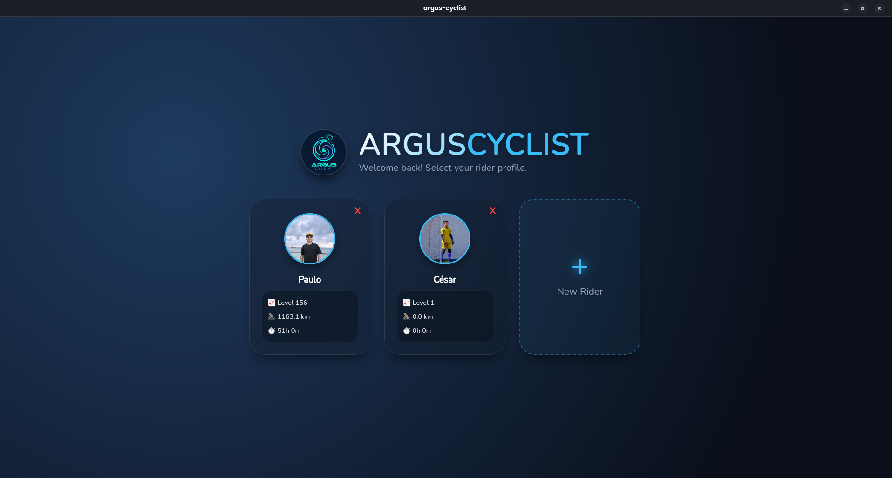
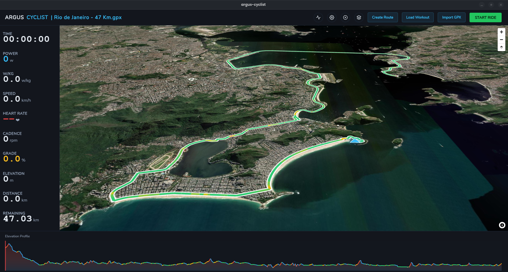
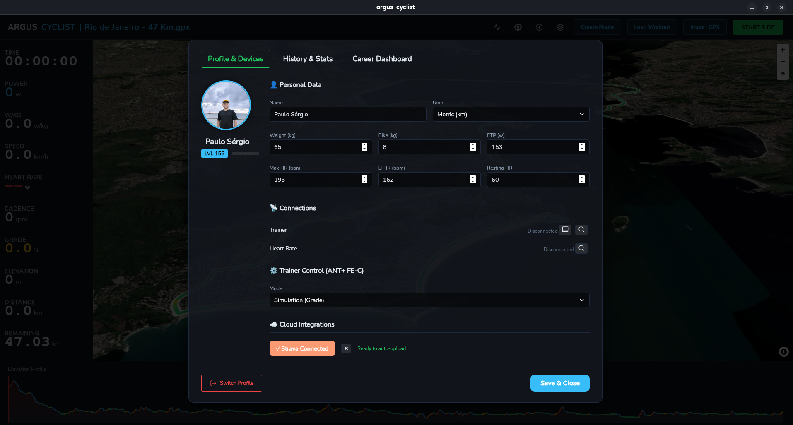
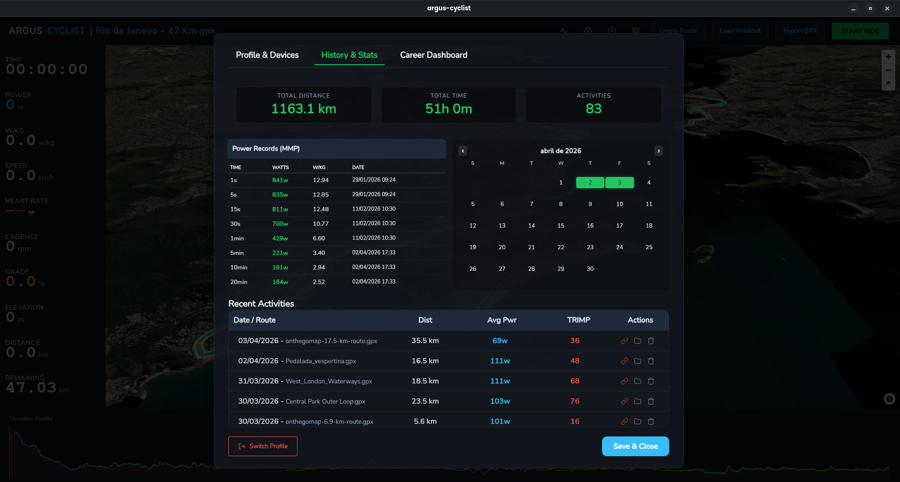
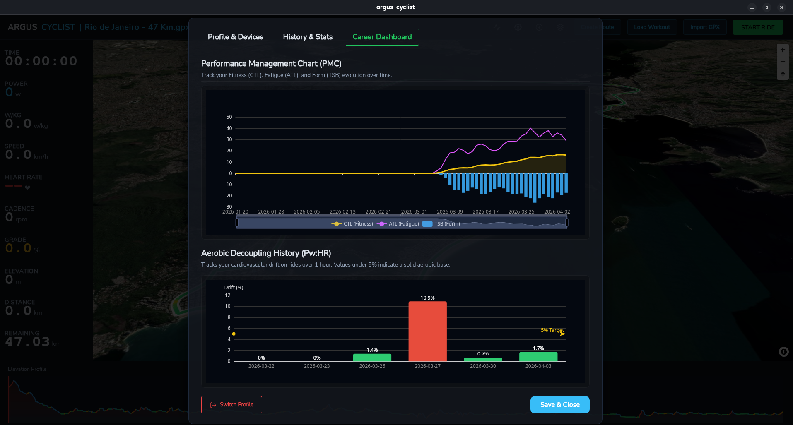
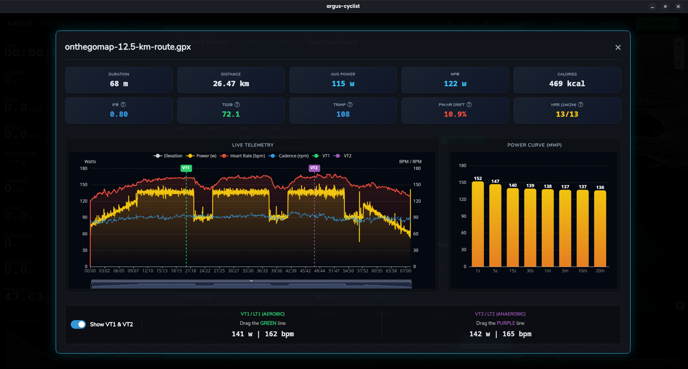
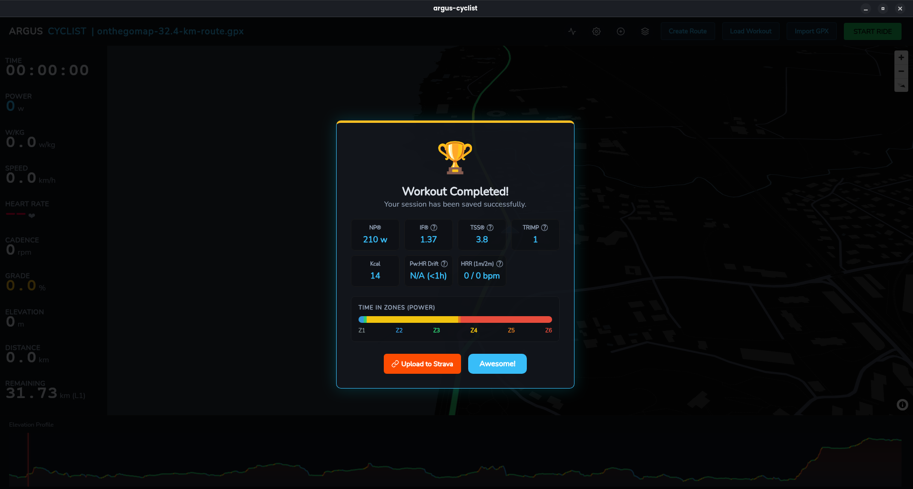
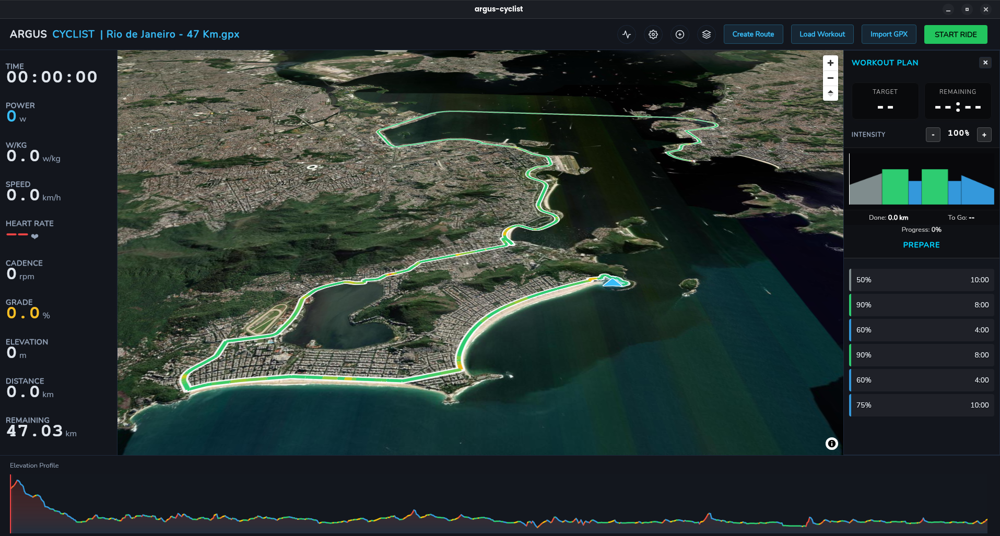
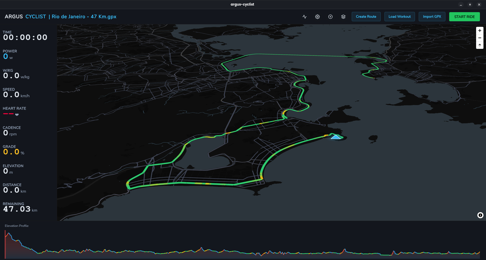
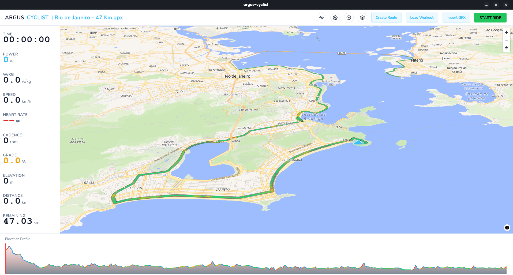

# Argus Cyclist Simulator


**Argus Cyclist** is a cross-platform open-source software for indoor cycling simulation, offering real-time communication with smart trainers, 3D map visualization, and support for multiple training modes such as free ride and structured workouts. Now available for both Desktop and Mobile!

## Screenshots

### Desktop Experience

| Home & Profile Selection | Virtual Ride & HUD |
| :---: | :---: |
|  |  |
| **Profile & Cloud Integrations** | **History & Stats** |
|  |  |
| **Career Dashboard (PMC)** | **Activity Telemetry & Analysis** |
|  |  |
| **Post-Ride Summary** | **Structured Workout Plan** |
|  |  |
| **Dark Theme Map** | **Light Theme Map** |
|  |  |

| Mobile Gaming HUD |
| :---: |
|  |

## Cross-Platform: Now on Mobile (Android)

Argus Cyclist isn't just for desktop anymore. Powered by **Capacitor.js**, the simulator now runs natively on Android devices, transforming your smartphone into a high-end cycling head unit.

* **Immersive Mobile HUD:** A fully responsive, landscape-forced "gaming mode" UI featuring glassmorphism elements to maximize 3D map visibility.
* **Native Bluetooth LE:** Direct connection to smart trainers and heart rate monitors using the mobile device's built-in Bluetooth antenna.
* **JS Physics Engine:** A dedicated JavaScript physics engine ensures accurate speed calculations (accounting for drag, rolling resistance, and gravity) directly on the mobile device, without requiring the Go backend.
* **Local File Parsing:** Import `.GPX` routes and `.ZWO` workout plans natively from your phone's storage.

## Simulation & Connectivity

* **Smart Trainer Support (BLE & ANT+):** Connects natively to FTMS and ANT+ FE-C compatible trainers (e.g., Tacx, Wahoo, Elite, Thinkrider) and Heart Rate monitors.
* **Physics Engine:** Real-time speed calculation based on power (Watts), rider weight, bike weight, rolling resistance, and aerodynamic drag.
* **Grade Simulation:** The trainer automatically adjusts resistance based on the virtual terrain slope.
* **Cloud Integrations:** Direct connection to Strava for automatic or manual upload of your finished sessions.

### Gamification & Progression

* **Multi-Profile System:** Create and manage multiple riders on the same device. Each profile has its own separate level, XP, FTP, weight settings, and activity history.
* **Leveling System:** Earn **XP (Experience Points)** passively by riding.
* **Dynamic Rewards:** Gain more XP for climbing and covering long distances.
* **Persistent Profile:** Your stats (Level, Total XP, FTP, Weight) are saved locally using SQLite.
* **Visual HUD:** Real-time XP bar and power zones.

### Immersive 3D Map

* **MapLibre Integration:** Powered by MapLibre GL JS with 3D Terrain-RGB for realistic topography. Features a 3D Globe projection with atmospheric fog.
* **Dynamic Themes:** Fully customizable map visualization with crisp **Light** and **Dark** themes.
* **Smart Route Rendering:** Route lines change color dynamically based on gradient (Green = Flat/Descent, Red = Steep Climb).
* **Occlusion System:** The route renders correctly behind 3D buildings for better depth perception.
* **Smooth Animation:** Interpolated cyclist movement at 60fps, eliminating GPS "jumping".

### Advanced Analytics & Tools

* **Career Dashboard:** Track your long-term evolution with the Performance Management Chart (PMC), mapping your Fitness (CTL), Fatigue (ATL), and Form (TSB). Also features an Aerobic Decoupling (Pw:HR) tracker to monitor your aerobic base.
* **Deep Activity Analysis:** Review your rides with advanced metrics including Normalized Power (NP), Intensity Factor (IF), TSS, and TRIMP. Dive into live telemetry charts with VT1/VT2 markers and detailed Power Curve (MMP) bar charts.
* **Post-Ride Summary:** Instant feedback upon workout completion with core stats and a quick "Upload to Strava" action.
* **Route Editor:** Create custom routes directly inside the app by clicking points on the map.
* **GPX & Structured Workouts:** Ride real-world routes by importing `.GPX` files or train efficiently with visual ERG mode targets using imported plans.
* **Activity History:** Calendar view, monthly stats, and recent rides list.
* **Data Export:** Automatically generates `.FIT` files compatible with Strava, Garmin Connect, and TrainingPeaks.

## Technologies

* **Backend:** Go (Golang)
* **Frontend:** JavaScript (ES6+), MapLibre GL JS + OSRM
* **Native Wrappers:** Wails (Desktop) & Capacitor (Android)
* **Database:** SQLite (for local user data)

## Prerequisites

Before starting, ensure you have installed:

* [Go](https://go.dev/) (v1.20+)
* [Node.js](https://nodejs.org/) & npm
* [Wails CLI](https://wails.io/) (`go install github.com/wailsapp/wails/v2/cmd/wails@latest`)
* [Android Studio](https://developer.android.com/studio) (for mobile compilation)

## Installation and Setup

1. **Clone the repository:**

    ```bash
    git clone [https://github.com/your-username/argus-cyclist.git](https://github.com/your-username/argus-cyclist.git)
    cd argus-cyclist
    ```

2. **Install dependencies:**

    ```bash
    # Go dependencies
    go mod tidy

    # Frontend dependencies
    cd frontend
    npm install
    cd ..
    ```

## How to Run

To start the application in development mode (with Hot Reload):

```bash
wails dev
