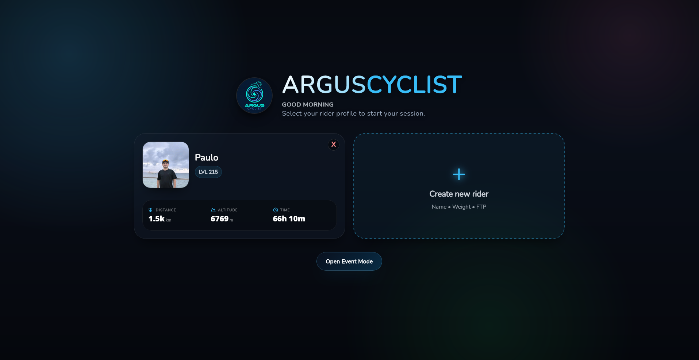
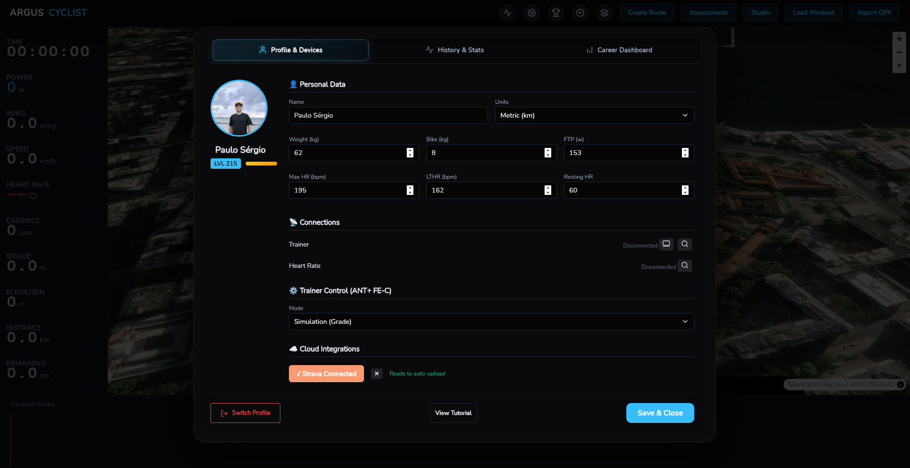
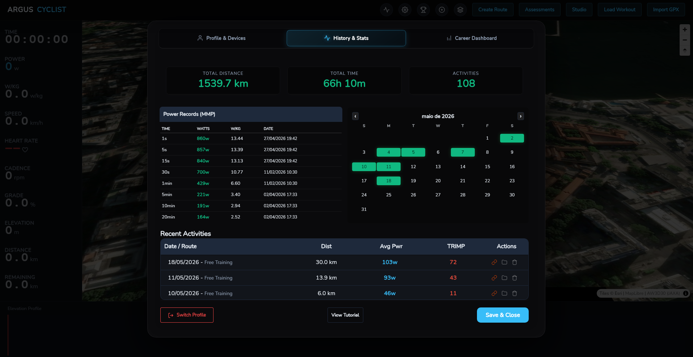
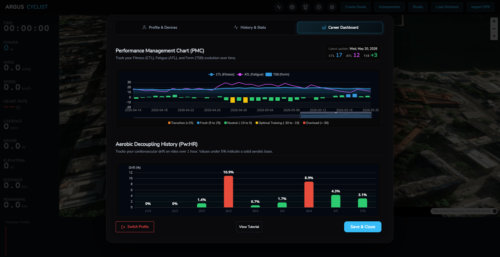
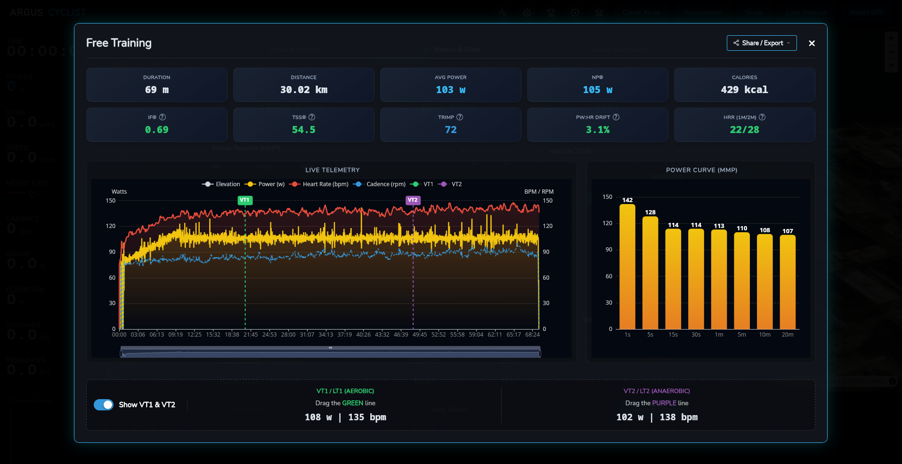
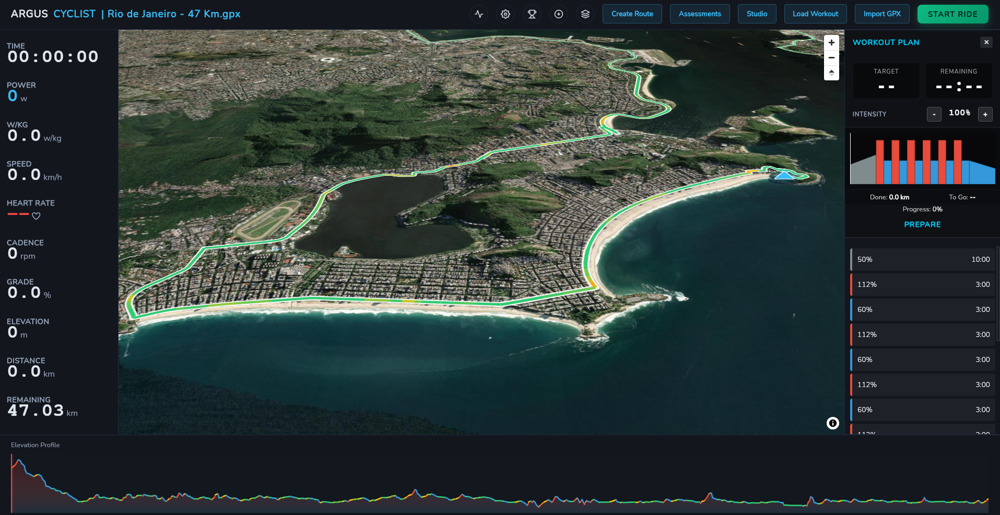
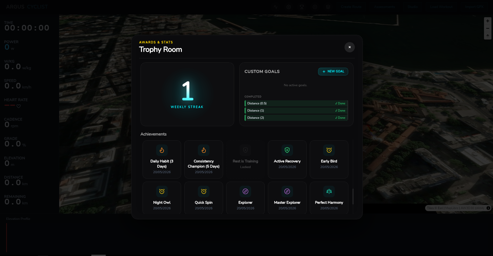
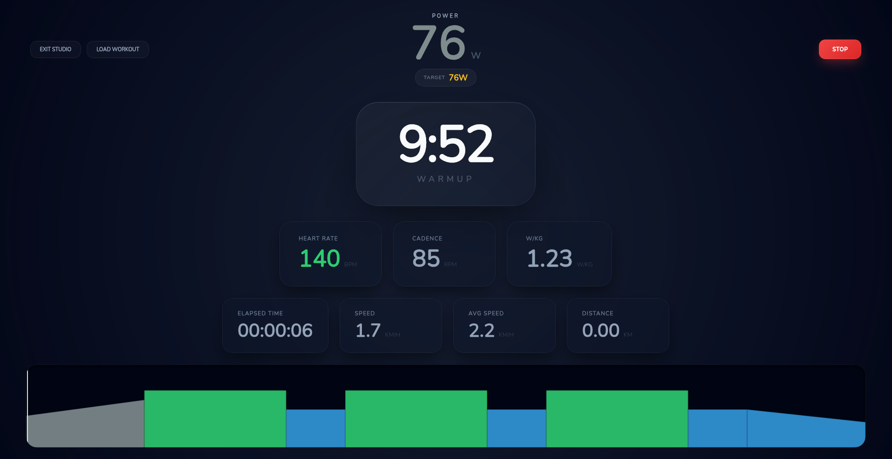
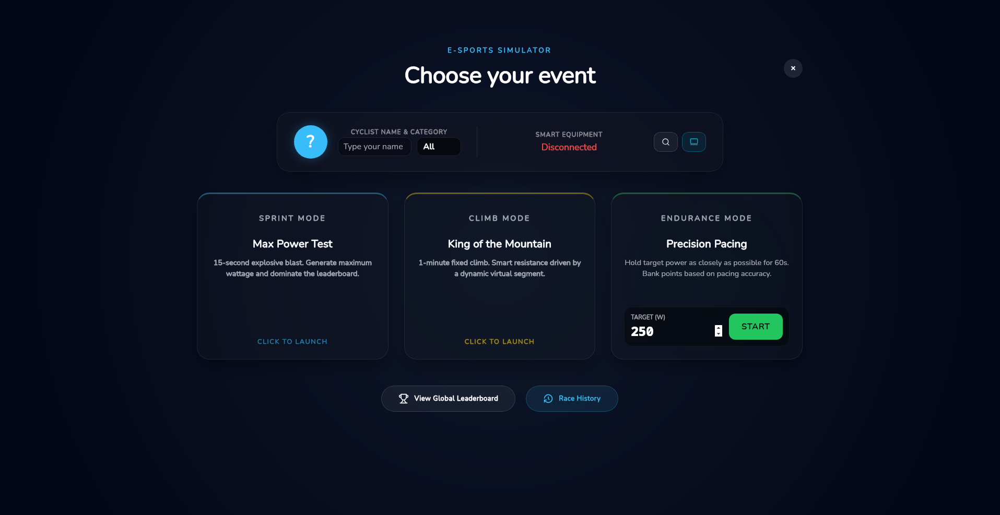

# Argus Cyclist Simulator


**Argus Cyclist** is a cross-platform open-source software for indoor cycling simulation, offering real-time communication with smart trainers, 3D map visualization, and support for multiple training modes such as free ride and structured workouts. Now available for both Desktop and Mobile!

## Screenshots

### Desktop Experience

| Home & Profile Selection | Profile & Cloud Integrations | History & Stats |
| :---: | :---: | :---: |
|  |  |  |
| **Career Dashboard (PMC)** | **Activity Telemetry & Analysis** | **Structured Workout Plan** |
|  |  |  |
| **Trophy Room** | **Studio Mode** | **Event Mode** |
|  |  |  |

## Cross-Platform: Now on Mobile (Android)

Argus Cyclist isn't just for desktop anymore. Powered by **Capacitor.js**, the simulator now runs natively on Android devices, transforming your smartphone into a high-end cycling head unit.

* **Immersive Mobile HUD:** A fully responsive, landscape-forced "gaming mode" UI featuring glassmorphism elements to maximize 3D map visibility.
* **Native Bluetooth LE:** Direct connection to smart trainers and heart rate monitors using the mobile device's built-in Bluetooth antenna.
* **JS Physics Engine:** A dedicated JavaScript physics engine ensures accurate speed calculations (accounting for drag, rolling resistance, and gravity) directly on the mobile device, without requiring the Go backend.
* **Local File Parsing:** Import `.GPX` routes and `.ZWO` workout plans natively from your phone's storage.

## Simulation & Connectivity

* **Smart Trainer Support (BLE & ANT+):** Connects natively to FTMS and ANT+ FE-C compatible trainers (e.g., Tacx, Wahoo, Elite, Thinkrider) and Heart Rate monitors.

## Windows (BLE) troubleshooting

* **Debug logs**: set `ARGUS_BLE_DEBUG=1` before starting the app to print detailed scan diagnostics to the terminal.
* **Discovery on Windows**: some Windows Bluetooth stacks do not expose advertised Service UUIDs during scanning. In this case, Argus will list nearby **named** BLE devices and validate FTMS/HR services after you select and connect.
* **Permissions**: typically you do **not** need to run as Administrator to scan BLE, but you must have Bluetooth enabled and allow the app to use Bluetooth in Windows privacy settings.
* **Physics Engine:** Real-time speed calculation based on power (Watts), rider weight, bike weight, rolling resistance, and aerodynamic drag.
* **Grade Simulation:** The trainer automatically adjusts resistance based on the virtual terrain slope.
* **Cloud Integrations:** Direct connection to Strava. Features an **Automatic Sync Queue** database model to gracefully handle expired tokens, refresh credentials, and schedule retry attempts on network failures.
* **Studio Mode:** A dedicated trainer-focused view with a clean, telemetry-only HUD dashboard. Optimized for indoor studio workouts, featuring real-time interval targets, power zones, and countdowns without the 3D map.
* **Event Mode:** Compete in virtual challenges (Sprints, KOMs, or Time Trials) with strict validation rules and local leaderboard rankings.

### Gamification & Progression

* **Multi-Profile System:** Create and manage multiple riders on the same device. Each profile has its own separate level, XP, FTP, weight settings, and activity history.
* **Leveling System:** Earn **XP (Experience Points)** passively by riding.
* **Dynamic Rewards:** Gain more XP for climbing and covering long distances.
* **Persistent Profile:** Your stats (Level, Total XP, FTP, Weight) are saved locally using SQLite.
* **Visual HUD:** Real-time XP bar and power zones.
* **Trophy Room & Custom Goals:** Setup personal training targets (Distance, Elevation, or Saddle Time) with specific deadlines and track progress in real-time. Unlocked achievements are colorfully rendered in the interactive Trophy Room.
* **Balanced Achievement System:** 11 consistency, recovery, routine, exploration, balance, and health cardiovascular milestones (Daily Habit, Consistency Champion, Rest is Training, Active Recovery, Early Bird, Night Owl, Quick Spin, Explorer, Master Explorer, Perfect Harmony, Cardio Recovery Master) with live toast notifications.

### Immersive 3D Map

* **MapLibre Integration:** Powered by MapLibre GL JS with 3D Terrain-RGB for realistic topography. Features a 3D Globe projection with atmospheric fog.
* **Dynamic Themes:** Fully customizable map visualization with crisp **Light** and **Dark** themes.
* **Smart Route Rendering:** Route lines change color dynamically based on gradient (Green = Flat/Descent, Red = Steep Climb).
* **Occlusion System:** The route renders correctly behind 3D buildings for better depth perception.
* **Smooth Animation:** Interpolated cyclist movement at 60fps, eliminating GPS "jumping".

### Advanced Analytics & Tools

* **Career Dashboard:** Track your long-term evolution with the Performance Management Chart (PMC), mapping your Fitness (CTL), Fatigue (ATL), and Form (TSB). Also features an Aerobic Decoupling (Pw:HR) tracker to monitor your aerobic base. Includes visual warning indicators (⚠️) for high cardiovascular drift (> 5%) during steady-state workouts.
* **Deep Activity Analysis:** Review your rides with advanced metrics including Normalized Power (NP), Intensity Factor (IF), TSS, TRIMP, and Heart Rate Recovery (HRR1/HRR2 in 1 and 2 minutes post-workout). Dive into live telemetry charts with VT1/VT2 markers and detailed Power Curve (MMP) bar charts.
* **Post-Ride Summary:** Instant feedback upon workout completion with core stats and a quick "Upload to Strava" action.
* **Route Editor:** Create custom routes directly inside the app by clicking points on the map.
* **GPX & Structured Workouts:** Ride real-world routes by importing `.GPX` files or train efficiently with visual ERG mode targets using imported plans.
* **Fitness Assessments:** Take structured fitness tests (such as Ramp Test and standard FTP Test) to assess your performance zones.
* **Activity History:** Calendar view, monthly stats, and recent rides list.
* **Data Export:** Automatically generates `.FIT` files compatible with Strava, Garmin Connect, and TrainingPeaks.

### AI Coach — Local LLM Training Assistant

* **Ollama Integration:** Connect to any locally running Ollama model (e.g., `qwen2.5:3b`) for a fully private, offline AI assistant.
* **Personalized Workout Generation:** Ask the AI to create a structured workout, and it generates a complete ZWO plan tailored to your FTP, weight, level, and recent training history.
* **Context-Aware Chat:** The assistant has access to your profile data (FTP, level, streak, recent activities) to give informed training advice.
* **Conversation History:** All chats are saved per profile, allowing you to revisit past recommendations.
* **One-Click Workout Loading:** AI-generated workouts can be saved as `.ZWO` files and loaded directly into the simulator with a single click.

### Bike Component Wear Tracking

* **Component Registry:** Add bike components (Chain, Cassette, Chainrings, Bottom Bracket, Tires, etc.) with brand, model, and install date.
* **Automatic Wear Calculation:** Wear is calculated as `(accumulated distance / expected lifespan) × 100%` and updated automatically after every workout.
* **Visual Wear Status:** Color-coded indicators — Green (< 50% wear), Yellow (50–80%), Red (≥ 80%) — with a "Replace soon" warning for critical components.
* **Replacement History:** Log replacements with reason and mileage at time of replacement for full maintenance traceability.
* **Customizable Lifespan:** Set expected lifespan in kilometers for each component type based on manufacturer recommendations or personal experience.

## Technologies

* **Backend:** Go (Golang)
* **Frontend:** JavaScript (ES6+), MapLibre GL JS + OSRM
* **Native Wrappers:** Wails (Desktop) & Capacitor (Android)
* **Database:** SQLite (for local user data)
* **AI:** Ollama (local LLM inference)

## Prerequisites

Before starting, ensure you have installed:

* [Go](https://go.dev/) (v1.20+)
* [Node.js](https://nodejs.org/) & npm
* [Wails CLI](https://wails.io/) (`go install github.com/wailsapp/wails/v2/cmd/wails@latest`)
* [Android Studio](https://developer.android.com/studio) (for mobile compilation)

## Installation and Setup

1. **Clone the repository:**

    ```bash
    git clone [https://github.com/your-username/argus-cyclist.git](https://github.com/your-username/argus-cyclist.git)
    cd argus-cyclist
    ```

2. **Install dependencies:**

    ```bash
    # Go dependencies
    go mod tidy

    # Frontend dependencies
    cd frontend
    npm install
    cd ..
    ```

## How to Run

To start the application in development mode (with Hot Reload):

```bash
wails dev
```

## Troubleshooting: Windows "Protect your PC" Warning

When launching the downloaded `.exe` on Windows for the first time, you may encounter a blue "Windows protected your PC" (Microsoft Defender SmartScreen) warning.

This happens because Argus Cyclist is an independent open-source project and the executable is currently not signed with a paid Authenticode Code Signing Certificate. The application is completely safe.

**To run the simulator:**

1. Click on **More info** text in the warning dialog.
2. Click the **Run anyway** button that appears at the bottom.
