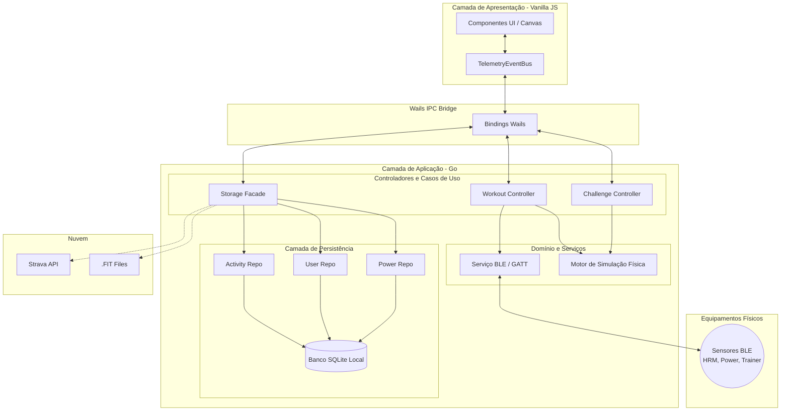
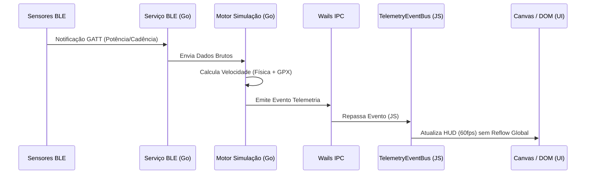

# Arquitetura do Sistema e Engenharia de Software

O **Argus Cyclist** foi projetado sob os princípios da *Clean Architecture*, promovendo uma separação estrita entre a camada de apresentação, regras de negócio e acesso a hardware/rede. A solução adota um modelo híbrido (*Desktop/Mobile*), centralizando a lógica pesada em uma linguagem de sistema.

## 1. Stack Tecnológico (Core)

* **Linguagem de Backend:** Go (Golang). Escolhida pela eficiência no gerenciamento de concorrência (*Goroutines*) e baixo consumo de memória, essenciais para manter conexões contínuas com múltiplos sensores BLE simultaneamente sem bloquear a *thread* principal.
* **Bridge IPC (Inter-Process Communication):** O framework **Wails** é utilizado para exportar os métodos Go (*structs*) para o frontend, criando ligações assíncronas nativas.
* **Frontend:** Implementado com Vite, Vue/Vanilla JS e CSS puro, focando em reatividade em tempo real (atualização de tela a 60fps) e suporte nativo a *Dark Mode*.
* **Mobile (Cross-Platform):** Integração com **Capacitor** para encapsular a aplicação Web em binários para Android, reutilizando a interface e substituindo chamadas de hardware de desktop por APIs móveis.

## 2. Topologia de Componentes Internos e Persistência

A aplicação passou por uma refatoração arquitetural baseada no padrão *Repository* e *Facade* para maximizar a escalabilidade:

* **Módulos Core (`ble` e `sim`):** O módulo `ble` atua como camada de abstração do hardware (scan/handshake GATT). O motor de simulação `sim` processa fisicamente gradientes (GPX) e eventos de gamificação (KOM e Sprints).
* **Persistência (`repository/sqlite`):** Implementação de repositórios granulares (`activity_repo`, `user_repo`, `power_repo`) conectados a um banco de dados SQLite local, substituindo serviços monolíticos de estado e garantindo disponibilidade *offline*.
* **Casos de Uso (`usecase/storage_facade`):** Uma fachada que orquestra as interações entre os repositórios, simplificando a lógica de negócio do armazenamento e fornecendo uma interface limpa para os controladores Wails.
* **Processamento FIT e Strava:** Serviços de serialização de métricas esportivas para o padrão binário `.fit` e integração em nuvem via OAuth 2.0.
* **Frontend Desacoplado:** Adoção de um `TelemetryEventBus` no Vanilla JS, isolando o barramento de eventos de telemetria das rotinas de atualização do DOM (Canvas/UI), reduzindo *reflows* e garantindo 60fps na renderização de desafios virtuais.

## 3. Diagrama de Arquitetura Geral

O diagrama abaixo ilustra a interação entre as camadas do sistema, destacando a separação de responsabilidades e o fluxo de comunicação entre o Frontend (JS) e o Backend (Go).

## 4. Fluxo de Comunicação de Telemetria (Tempo Real)

A simulação de ciclismo virtual exige uma comunicação de baixíssima latência. O diagrama de sequência abaixo demonstra como os dados trafegam do sensor até a renderização gráfica no momento do pedal.

